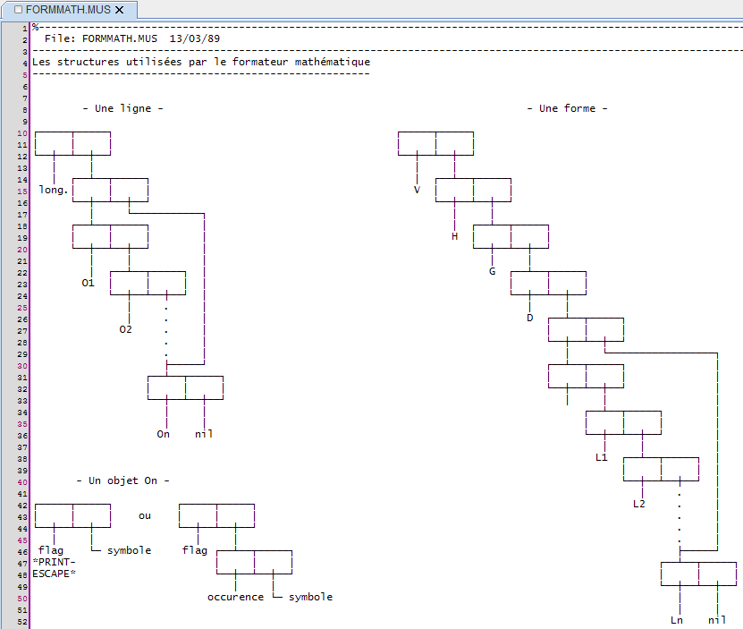
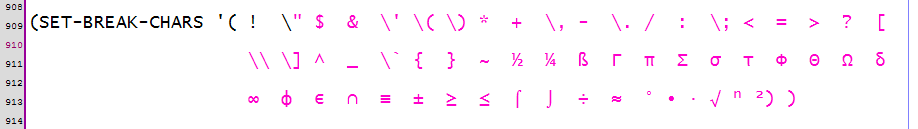
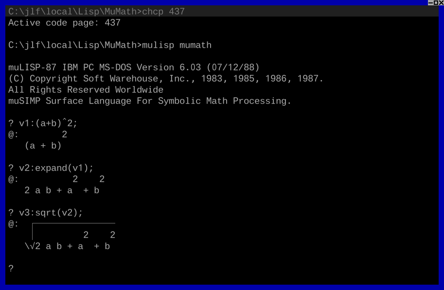

FormMath for muLISP-87/muMATH
=============================

Software from the 80s.

Description
-----------

[muMATH][mumath] is a computer algebra system (CAS), which was developed in the late 1970s and early eighties by Albert D. Rich and David Stoutemyer of Soft Warehouse in Honolulu, Hawaii.
It was implemented in the [muSIMP][musimp] programming language which was built on top of a LISP dialect called [muLISP][mulisp]. 
Platforms supported were CP/M and TRS-DOS (since muMATH-79), Apple II (since muMATH-80) and DOS (in muMATH-83, the last version, which was published by Microsoft).

FormMath is an extension for muLISP-87 (16 bits), that I implemented in 1989. 
It's a formatter which displays in 2D the mathematical expressions calculated by muMATH.
When the expression doesn't fit the 25x80 DOS screen, an horizontal/vertical scrolling is activated.

Tested with muLISP-87 IBM PC MS-DOS Version 6.03 (07/12/88), using [DOSBox][dosbox] or [vDosPlus][vdosplus].

Source files
------------

The source files are encoded CP-437.
[Code page 437][wikipedia_cp437] is the character set of the original IBM PC (personal computer), or DOS.

The tab size is 8 characters.

The comments are in french.

When you load the source file EXTSRC/FORMMATH.MUS in your editor, you should see something like that:

The break characters in SRC/MUSIMP.LSP must be displayed like that:

Creation of the file MUMATH.SYS with FormMath preloaded
-------------------------------------------------------

Create a directory `DIR`. 

Copy your executable `MULISP.COM` in the directory `DIR`.

Copy the files `EXTSRC/EXTMLISP.BIN`, `EXTSRC/EXTMLISP.LSP`, `EXTSRC/FORMMATH.MUS` in the directory `DIR`. 

Copy your muMATH source files in the directory `DIR`.  

Insert the contents of the file `SRC/ARITH%.MUS` in the file `DIR/ARITH.MUS`, before the demo section.   

Idem for `SRC/ARRAY%.ARI`, `SRC/EQN%.ALG`, `SRC/LOG%.ALG`, `SRC/SOLVE%.EQN`. 

Copy the file `SRC/MUSIMP.LSP` in the directory `DIR`.

Then execute this sequence of commands (the indentation is used to better visualize the dependencies):

    mulisp                                      % Start muLISP %
    (load "EXTMLISP.LSP")                       % Load the binary extension EXTMLISP.BIN %
    (load "MUSIMP.LSP")                         % Load the surface language muSIMP %
        rds("FORMMATH.MUS");
        save("MUSIMP.SYS");                     % At this step, you have the muSIMP language with FormMath preloaded %
        demo: nil;                              % to not execute the demos %
        rds("ARITH.MUS");                       % 10/01/83 %
            rds("ALGEBRA.ARI");                 % 09/28/83 %
                rds("ABSVAL.ALG");              % 10/01/83 %
                rds("DIF.ALG");                 % 09/30/83 %
                    rds("INT.DIF");             % 12/17/83 %
                        rds("INTMORE.INT");     % 09/22/83 %
                    rds("LIM.DIF");             % 10/01/83 %
                    rds("SIGMA.DIF");           % 10/01/83 %
                rds("EQN.ALG");                 % 10/01/83 %
                    rds("SOLVE.EQN");           % 10/01/83 %
                        rds("ODE.SOL");         % 12/17/83 %
                            rds("ODEMORE.ODE"); % 12/17/83 %
                            rds("ODENTH.ODE");  % 12/17/83 %
                rds("HYPER.ALG");               % 01/09/84 %
                rds("LOG.ALG");                 % 10/01/83 %
                rds("TRG.ALG");                 % 01/09/84 %
                    rds("ATRG.TRG");            % 10/01/83 %
            rds("ARRAY.ARI");                   % 09/27/83 %
                rds("MATRIX.ARR");              % 10/01/83 %
                    rds("LINEQN.MAT");          % 10/01/83 %
                rds("VEC.ARR");                 % 10/01/83 %
                    rds("VECDIF.VEC");          % 10/01/83 %
        rds("APPROXIM.MUS");                    % 07/09/89 %
        demo: 'demo;
        save("MUMATH.SYS");                     % At this step, you have the muMATH system with FormMath preloaded %
        system();                               % Exit muLISP %

        
Demo
----

    vDosPlus                                    # Launch the emulator vDosPlus
    chcp 437                                    # Select the code page 437
    mulisp mumath                               # Launch muMATH
    v1:(a+b)^2;
    v2:expand(v1);
    v3:sqrt(v2);

[dosbox]: https://www.dosbox.com/wiki/Main_Page "DOSBox"
[mulisp]: http://www.edm2.com/index.php/MuLISP "muLISP"
[mumath]: https://en.wikipedia.org/wiki/MuMATH "muMATH"
[musimp]: http://hopl.info/showlanguage2.prx?exp=2265 "muSIMP"
[vdosplus]: http://vdosplus.org "vDosPlus"
[wikipedia_cp437]: https://en.wikipedia.org/wiki/Code_page_437 "Wikipedia Code Page 437"
